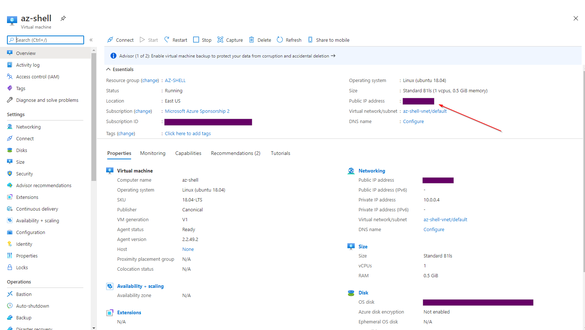
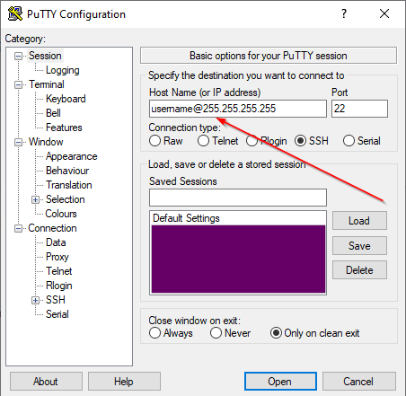
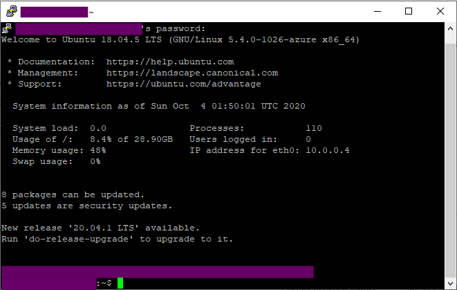
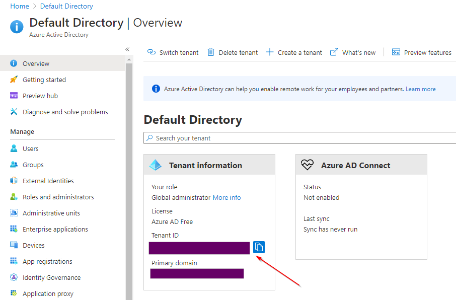
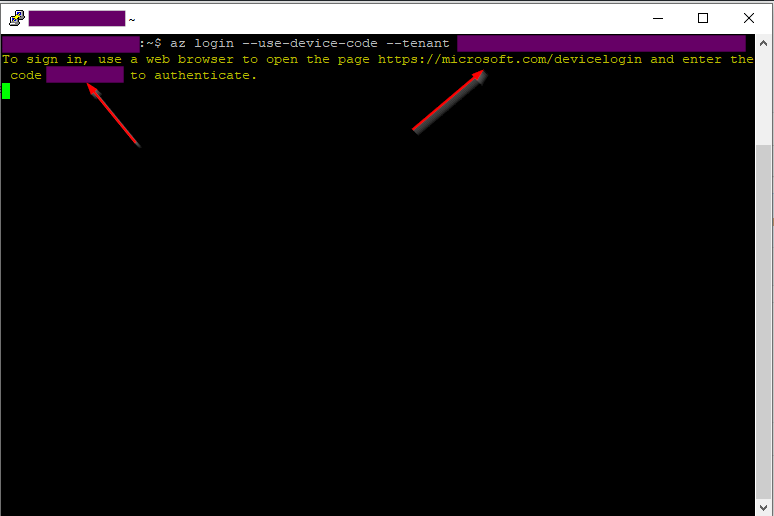
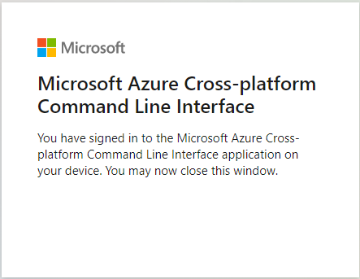
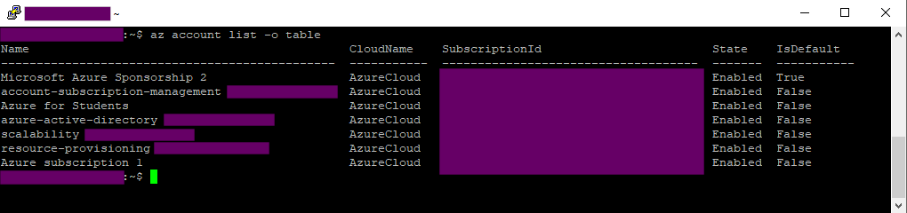
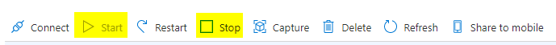

# az-cli

1. Login to Azure portal.
2. Go to Resource Groups and click `+Add`.
3. Provide the name of the resource group (e.g., `az-shell`) and make sure an appropriate region is selected.
4. Click `Review + create`.
5. Go to Virtual machines and click `+Add`.
6. For Resource group select the one you have just created. Provide the name of the new VM (e.g., `az-shell-vm`) and make sure an appropriate region is selected. For Image go with Ubuntu Server 18.04 LTS. As size pick something minimal, such as `B1ls`. Change Authentication type to Password. Fill in the Username and Password (remember them as you will need them later). Leave the default Inbound port rules unchanged (Allow SSH (22)).
7. Click `Review + create`.
8. Download and install [Putty](https://the.earth.li/~sgtatham/putty/latest/w64/putty-64bit-0.74-installer.msi).
9. Go to the VM you just created and copy the public IP.



10. Open Putty. In the Host Name field fill in `<your-username>`@`<public-ip-of-your-vm>`.



11. Click `Open` and enter your password when prompted. If everything went right you should see a screen similar to the below.



12. Install Azure CLI.

```
curl -sL https://aka.ms/InstallAzureCLIDeb | sudo bash
```

13. In Azure portal go to Azure Active Directory and copy your Deafult Directory Tenant ID.



14. Login to your az acount by issuing the below command in Putty.

```
az login --use-device-code --tenant <your-tenant-id>
```

15. In your browser go to https://microsoft.com/devicelogin and enter the code displayed on the Putty screen.



16. Login to your Azure account. If everything went well you should see the below in your browser.



17. Enjoy working in Azure CLI!



18. When you are done with your work you can exit from the Putty session with the `exit` command. You can always come back by repeating steps 10, 11, 14, 15, and 16.

The instance you have provisioned should cost around $4/month. If you want to minimize the cost `Stop` the machine when you do not need it (the VM page in Azure portal) and Start it when you do.



Delete the Resource group once you no longer have a need for the machine.